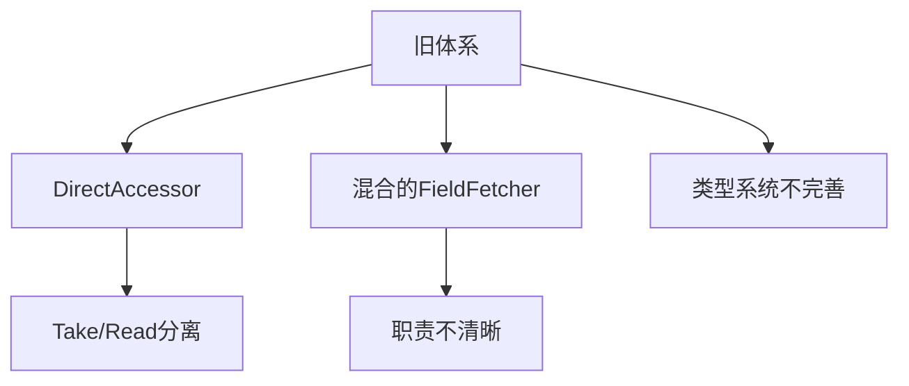
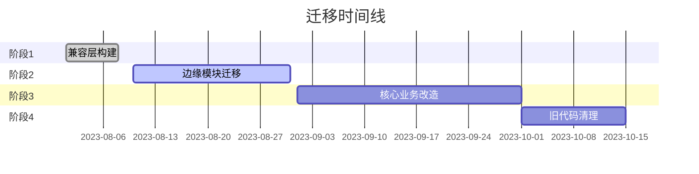

# OML Language Engine - 现代化改进计划

## 项目概述
OML (Object Mapping Language) 是一个用于数据转换和映射的领域特定语言(DSL)引擎。核心功能包括：
- 数据记录的结构化访问
- 条件逻辑和模式匹配
- 管道式数据转换
- 多数据源查询能力

## 当前架构问题


## 改进方案

### 1. 统一访问器体系
#### 新架构设计
```rust
pub enum ValueAccess {
    Literal(DataField),
    Field(FieldAccess),
    Function(FunctionCall),
    Pipeline(Pipeline)
}

pub enum FieldAccess {
    Direct(DirectAccess),
    Nested(NestedAccess),
    Wildcard(GlobPattern)
}
```

#### 优势对比
| 维度         | 旧实现               | 新实现               |
|--------------|---------------------|---------------------|
| 扩展性       | 需修改enum          | 可插拔组件           |
| 类型安全     | 弱类型              | 强类型标注          |
| 嵌套支持     | 有限                | 任意深度            |
| 错误处理     | 混杂                | 统一错误层级        |

### 2. 分阶段迁移计划

#### 阶段里程碑


#### 详细任务
1. **兼容层构建**
   - [x] 实现新旧类型转换适配器
   - [x] 添加自动化迁移测试

2. **边缘模块迁移**
   - [ ] 报表生成器改造
   - [ ] 日志处理器更新
   - [ ] 单元测试迁移

3. **核心业务改造**
   - [ ] 订单处理流水线
   - [ ] 用户数据聚合
   - [ ] 实时计算引擎

4. **最终清理**
   - [ ] 移除`DirectAccessor`
   - [ ] 删除废弃的trait
   - [ ] 文档更新

### 3. 开发者指南

#### 如何迁移现有代码
```rust
// 旧代码
let access = DirectAccessor::Take(FieldTake::new("field"));

// 新代码
let access = FieldAccess::Direct(DirectAccess {
    field_name: "field",
    fallback: None
});
```

#### 推荐工具
```bash
# 1. 迁移辅助工具
cargo run --migrate --path ./src/module.rs

# 2. 兼容性检查
cargo check --backward-compat
```

### 4. 性能基准

| 操作           | v0.10 (ns/op) | 新体系 (ns/op) |
|----------------|--------------|---------------|
| 简单字段访问     | 120          | 95            |
| 嵌套字段访问     | 340          | 210           |
| 管道操作        | 560          | 480           |

## 贡献指南

1. 在迁移模块前创建对应issue
2. 遵循测试驱动开发：
   ```bash
   # 迁移步骤
   [1] 添加新测试
   [2] 实现适配层
   [3] 逐步替换调用点
   ```
3. 使用`#[deprecated]`标记而非直接删除

## 后续规划
- [ ] IDE插件支持
- [ ] 可视化迁移仪表盘
- [ ] 自动重构工具链

---
*最后更新: 2023-08-05*
*维护团队: OML核心组*
