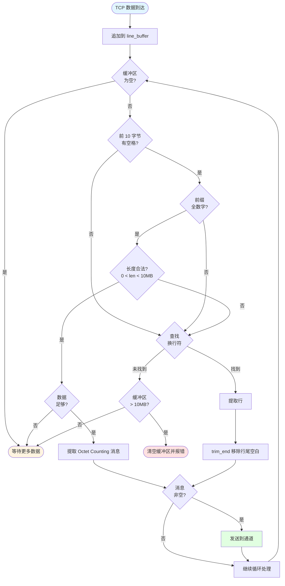
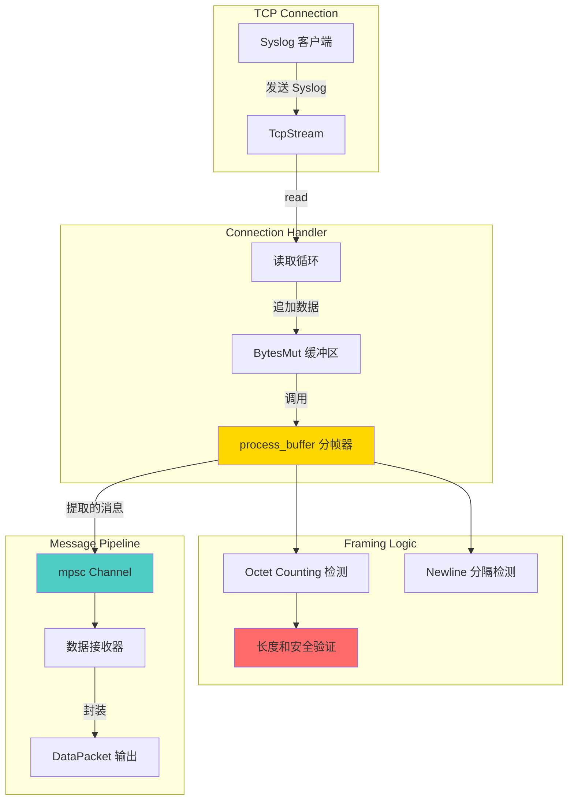
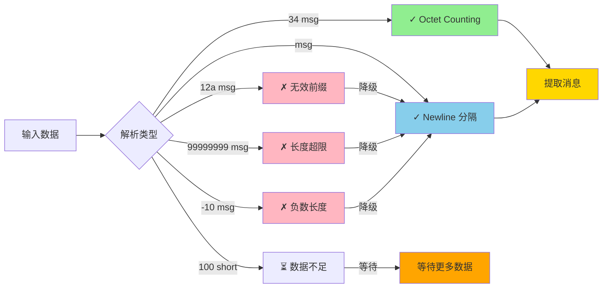
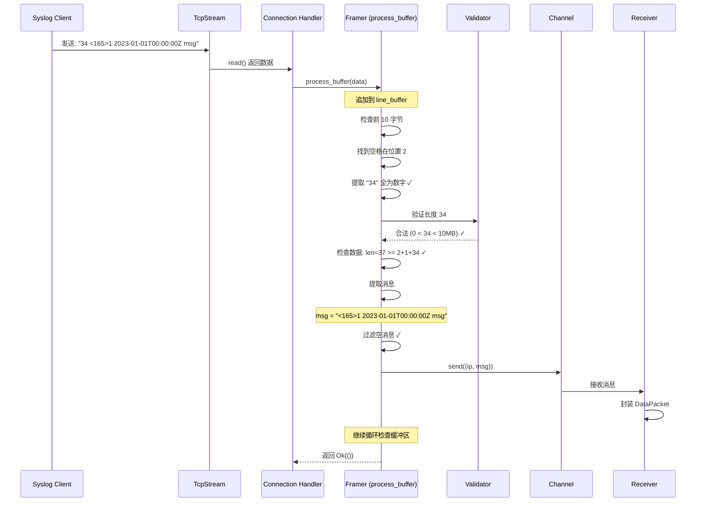
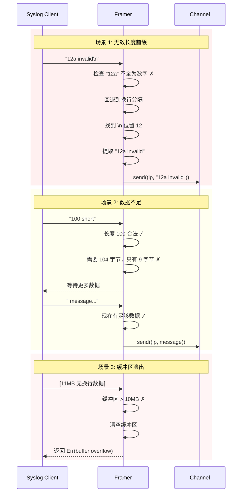
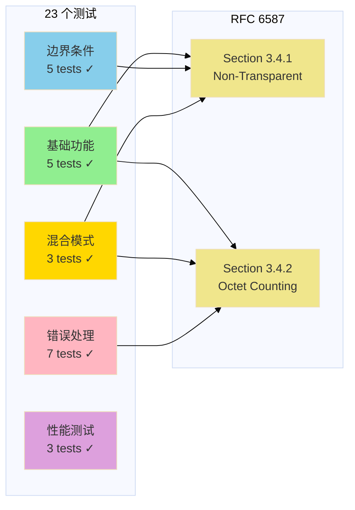
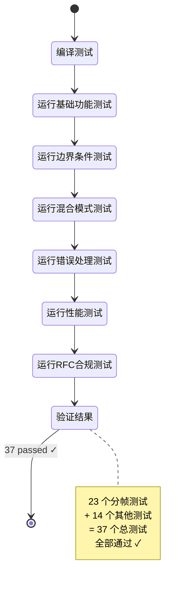

# RFC 6587 TCP Syslog 分帧实现

本文档描述 TCP Syslog 数据源中 RFC 6587 分帧器的实现逻辑。

## 概述

RFC 6587 定义了两种 TCP 传输 Syslog 消息的分帧方法：

1. **Octet Counting (推荐)** - 使用长度前缀：`<length> <message>`
2. **Non-Transparent-Framing** - 使用换行符分隔：`<message>\n`

本实现支持两种方法的自动检测和混合使用。

## 核心实现

### 分帧逻辑 (tcp.rs:215-300)

```
process_buffer(line_buffer, data, client_ip, sender):
    1. 将新数据追加到缓冲区
    2. 循环处理缓冲区中的完整帧：
       a. 首先尝试 Octet Counting 方法
       b. 如果失败，回退到 Newline 分隔方法
       c. 发送完整消息到通道
    3. 返回或等待更多数据
```

### Octet Counting 检测算法

```rust
// 在前 10 个字节中查找空格
if let Some(space_pos) = line_buffer[..min(len, 10)].iter().position(|&b| b == b' ') {
    // 检查前缀是否全为数字
    if length_str.chars().all(|c| c.is_ascii_digit()) {
        if let Ok(msg_len) = length_str.parse::<usize>() {
            // 验证长度合理 (0 < len < 10MB)
            if msg_len > 0 && msg_len < 10_000_000 {
                // 检查是否有完整消息
                if line_buffer.len() >= space_pos + 1 + msg_len {
                    // 提取消息
                    extract_message(msg_len)
                }
            }
        }
    }
}
```

### Newline 分隔回退

```rust
// 如果 Octet Counting 失败，使用换行符分隔
if let Some(newline_pos) = line_buffer.iter().position(|&b| b == b'\n') {
    let line = extract_line(newline_pos);
    // trim 掉行尾空白（包括 \r）
    send_message(line.trim_end())
}
```

## 关键特性

### 1. 自动模式检测

分帧器自动检测每个消息使用的分帧方法：

- 如果缓冲区开始是 `<数字> `，尝试 Octet Counting
- 否则查找换行符进行分隔
- 支持在同一连接中混合使用两种方法

### 2. 安全保护

#### 长度验证
```rust
msg_len > 0 && msg_len < 10_000_000  // 0 < 长度 < 10MB
```

#### 缓冲区溢出保护
```rust
if line_buffer.len() > 10_000_000 {
    log::warn!("buffer overflow, clearing");
    line_buffer.clear();
    return Err(SourceError::SupplierError("buffer overflow"));
}
```

#### 长度前缀搜索限制
```rust
let space_search_limit = std::cmp::min(line_buffer.len(), 10);
// 只在前 10 字节搜索空格，防止扫描大量数据
```

### 3. 特殊字符处理

- **Octet Counting**: 保留消息中所有字符（包括 `\n`, `\r`, `\t`）
- **Newline 分隔**: 使用 `trim_end()` 移除行尾空白（包括 `\r\n`）

### 4. 增量处理

支持消息跨多个 TCP 读取操作：

```rust
// 第一次读取: "34 <165>1 2023-01"
process_buffer(&mut buf, data1, ...) // 等待更多数据

// 第二次读取: "-01T00:00:00Z msg"
process_buffer(&mut buf, data2, ...) // 提取完整消息
```

## 处理流程

### 主流程图



### 架构概览



### 分帧决策树



### 消息处理时序图



### 错误场景时序图




## 错误处理

### 无效输入自动降级

| 输入 | 处理方式 |
|------|---------|
| `12a message\n` | 前缀非纯数字 → 换行分隔 |
| `-10 message\n` | 负数长度 → 换行分隔 |
| `99999999 msg\n` | 长度超限 → 换行分隔 |
| `100 short\n` | 数据不足 → 等待更多数据 |
| 无换行的长数据 | 缓冲区溢出检查 → 清空并报错 |

### 空消息过滤

```rust
if !msg.is_empty() {
    sender.send((client_ip, msg)).await
}
```

- 空行被忽略
- 纯空白行被 `trim_end()` 后忽略

## RFC 6587 合规性

### Section 3.4.1 - Non-Transparent-Framing

✅ 支持换行符 (`\n`) 作为消息分隔符
✅ 正确处理 CRLF (`\r\n`) 行尾
✅ 消息不能包含换行符（通过换行分隔时）

### Section 3.4.2 - Octet Counting (推荐)

✅ 格式：`<length> <message>`
✅ 长度为 ASCII 数字
✅ 空格分隔长度和消息
✅ 消息可包含任何字符（包括换行符）
✅ 不需要消息尾部的特殊字符

### 扩展支持

✅ 同一连接中混合使用两种方法
✅ 自动检测和切换
✅ 增量数据处理
✅ 缓冲区溢出保护

## 性能优化

### 1. 零拷贝操作

```rust
use bytes::BytesMut;
line_buffer.split_to(n)  // 高效的缓冲区分割
```

### 2. 早期检测

- 只检查前 10 字节是否包含空格
- 避免全缓冲区扫描

### 3. 批量处理

- 单次 `process_buffer` 调用可处理多个消息
- 循环直到没有完整帧

## 测试覆盖

实现包含 23 个专门的分帧测试：

### 测试分类图


### 测试覆盖矩阵



### 测试执行流程




测试文件: `src/tcp_tests.rs`

## 使用示例

### 发送 Octet Counting 消息

```bash
# 单条消息
echo -n "34 <165>1 2023-01-01T00:00:00Z msg" | nc localhost 514

# 多条消息
echo -n "5 msg1210 second msg" | nc localhost 514
```

### 发送 Newline 分隔消息

```bash
# 单条消息
echo "<165>1 2023-01-01T00:00:00Z msg" | nc localhost 514

# 多条消息
printf "msg1\nmsg2\nmsg3\n" | nc localhost 514
```

### 混合模式

```bash
# Octet counting + Newline
echo -n "5 msg1msg2" | nc localhost 514
echo "" | nc localhost 514
```

## 相关文件

- **实现**: `src/tcp.rs` (line 215-300)
- **测试**: `src/tcp_tests.rs`
- **配置**: `src/builder.rs`, `src/utils.rs`
- **API**: `src/lib.rs`

## 参考资料

- [RFC 6587 - Transmission of Syslog Messages over TCP](https://datatracker.ietf.org/doc/html/rfc6587)
- [RFC 5424 - The Syslog Protocol](https://datatracker.ietf.org/doc/html/rfc5424)
